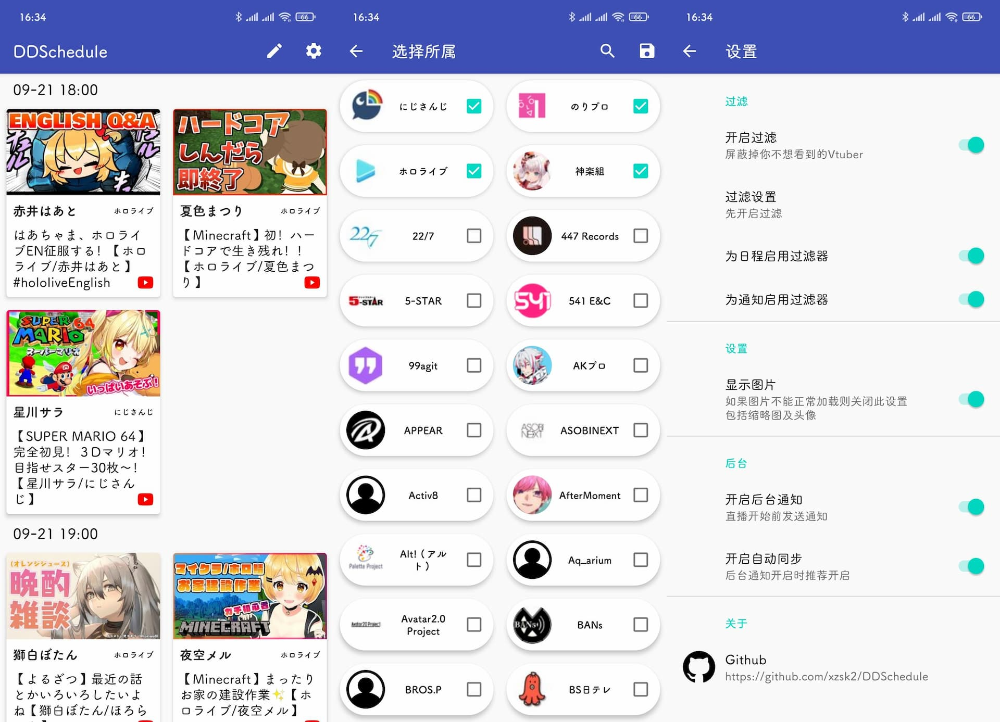

# DDSchedule

<!-- PROJECT SHIELDS -->
[](https://install.appcenter.ms/users/Sakari/apps/DDSchedule)

Vtuber直播日程表APP（Android）

## 功能

- Youtube直播日程
- Bilibili直播日程（B限及VUP）
- 开播前15分钟左右提醒
- 省电，无后台常驻服务
- 名单模式，可选择自己单推（DD）的V

## 安装

从 [Releases](https://github.com/xzsk2/DDSchedule/releases) 下载（建议）

或从 [CI Build](https://install.appcenter.ms/users/Sakari/apps/DDSchedule) 下载开发版（可能不稳定）

## 注意

- ~~目前只支持整个组合/企业的日程订阅~~ 已实现名单模式
- Bilibili相关日程在选择页面搜索 ```Bilibili```
- 若通知不正常，请尝试将本APP加入电池优化白名单（如MIUI自启动）
- 部分图片从Youtube/Twitter中获取，如显示异常请尝试关闭设置中的相关选项
- B站数据从 [直播日历](https://live.bilibili.com/p/html/live-web-calendar) 中获取，数据缺失可能是字幕组没填

## 截图



## 数据源

- Youtube : [VNUMA](https://hiyoko.sonoj.net/schedule/)
- Bilibili : [ihateani.me](https://api.ihateani.me/)

## License

[MIT license](LICENSE)
